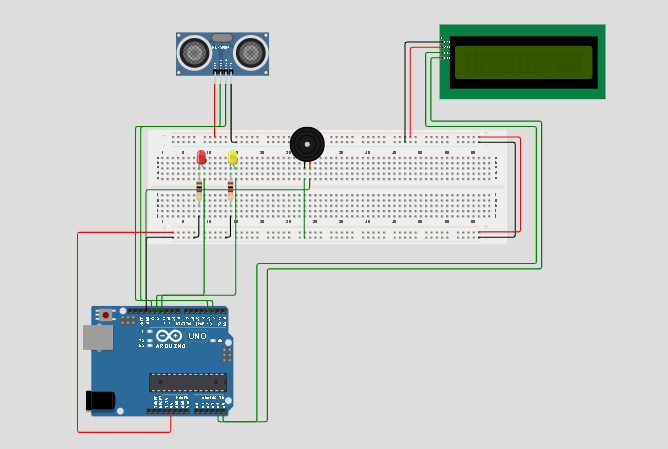
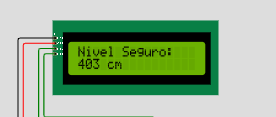
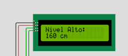
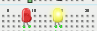
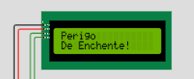
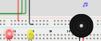

# 🚨 Sistema de Monitoramento de Enchentes com Arduino

Este projeto utiliza um sensor ultrassônico, LEDs, buzzer e um display LCD para monitorar o nível da água e alertar sobre risco de enchentes. Foi desenvolvido e simulado na plataforma [Wokwi](https://wokwi.com/).

## 🔧 Componentes Utilizados

- Arduino Uno
- Sensor Ultrassônico (HC-SR04)
- Display LCD 16x2 com módulo I2C
- LED Vermelho
- LED Amarelo
- Buzzer
- Jumpers e protoboard

## 🖼️ Imagens do Projeto (simulação Wokwi)

### 1. Projeto Desligado

---

### 2. Nível Seguro

---

### 3. Nível Alto

---

### 4. Perigo de Enchente

_(nível de água abaixo de 150 cm, acionando alarme sonoro e LED vermelho)_  

---

## 🧠 Lógica do Sistema

O sistema funciona da seguinte forma:

- Mede a distância do sensor ao nível da água usando o sensor ultrassônico.
- Classifica a situação de acordo com a distância:
  - **> 200 cm**: Nível seguro
  - **150–200 cm**: Nível alto (LED amarelo aceso)
  - **< 150 cm**: Perigo de enchente (LED vermelho + alarme sonoro)
- Exibe informações no display LCD em tempo real.

## ▶️ Como Simular o Projeto

Acesse o simulador com o link do projeto:
[Link para o simulador Wokiwi](https://wokwi.com/projects/432782066990787585)

## 👥 Integrantes do Grupo

<table>
  <tr>
    <td align="center">
      
       
      Vitor Alcantara
       
      RM: 565885
       <a href="https://github.com/VitorAlcantara-tech" target="_blank">GitHub</a>
      • <a href="https://www.linkedin.com/in/vitor-alcantara" target="_blank">LinkedIn</a>
    </td>
    
  <td align="center">
      
       
      Thiago Lima
       
      RM: 563416
       <a href="https://github.com/thiagolima-tech" target="_blank">GitHub</a>
      • <a href="https://www.linkedin.com/in/thiago-lima-cavalcanti-8446bb317/" target="_blank">LinkedIn</a>
    </td>
    
  <td align="center">
      
       
      Matheus Vasques
       
      RM: 563309
       <a href="https://github.com/maatvasques" target="_blank">GitHub</a>
      • <a href="https://www.linkedin.com/in/matheus-vasques-santos-21a187357/">LinkedIn</a>
    </td>
